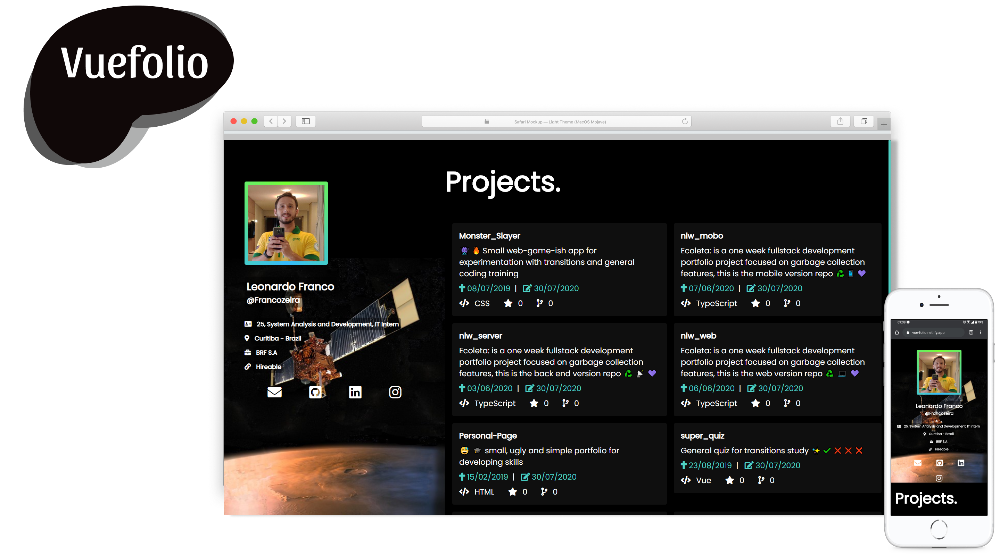
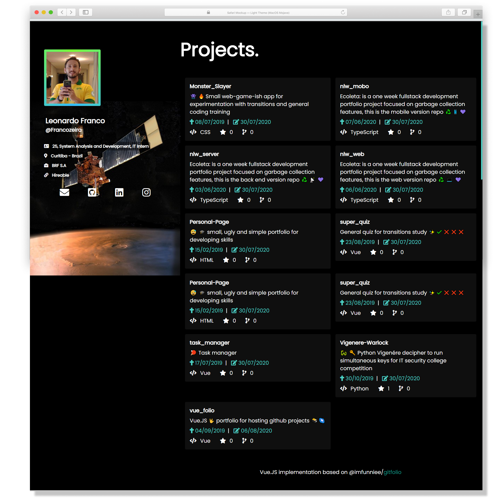

# Vuefolio :octocat: :bookmark: :milky_way:

 ![React_Badge][web_react_badge]   ![Node_Badge][vue_version_badge]

Vuefolio is a user portfolio for github projects made with Vue.Js. It can be easily used for every github user via changing a simple variable and also has a very customizable inteface.

<!-- WORK HERE -->
<!--  -->

This project started at the moment i saw this beautiful [portfolio](https://github.com/imfunniee/gitfolio) made by [@imfunniee](https://github.com/imfunniee), so with all credits given to this implementation i started to try to come up with a version of the same website with Vue.js, and halfway through the development i started to add a little salt of my own, and in the end i got satisfied with this final version.

As i started the project, i wasn't confident at all with my CSS skills, so i went for the use of [Tailwind Framework](https://tailwindcss.com/), and after an almost a year hiatus i went back to the project i thought it was easier to add some style features with CSS directly, so i'm aware that the use of tailwind is not at its best here.

You can can check here the live demo of: [Vue-folio](https://vue-folio.netlify.app/)

## :pencil2: Customizing
For using this portfolio with your GitHub account, simply change the variable `userURL` inside `Home.vue` file to `'https://api.github.com/users/<YOUR USERNAME>'` and you'll just have all of your public repos listed.

As a dark-mode fan i only made this pitch black version, but editing its colors/behavior should be just as easy.

------------

## :art: Images
<!-- WORK HERE -->

<!--  -->
<!-- > Full web and mobile experience -->

------------

## Project setup

As a default Vue project, you have all the npm commands below avaliable:

### Instal all dependencies
```
npm install
```

### Compiles and hot-reloads for development
```
npm run serve
```

### Compiles and minifies for production
```
npm run build
```

### Lints and fixes files
```
npm run lint
```

### Customize configuration
See [Configuration Reference](https://cli.vuejs.org/config/).

<!-- Badges -->

[vue_version_badge]: https://img.shields.io/badge/vue-2.x-brightgreen.svg

[web_react_badge]: https://img.shields.io/badge/web-vue-blue